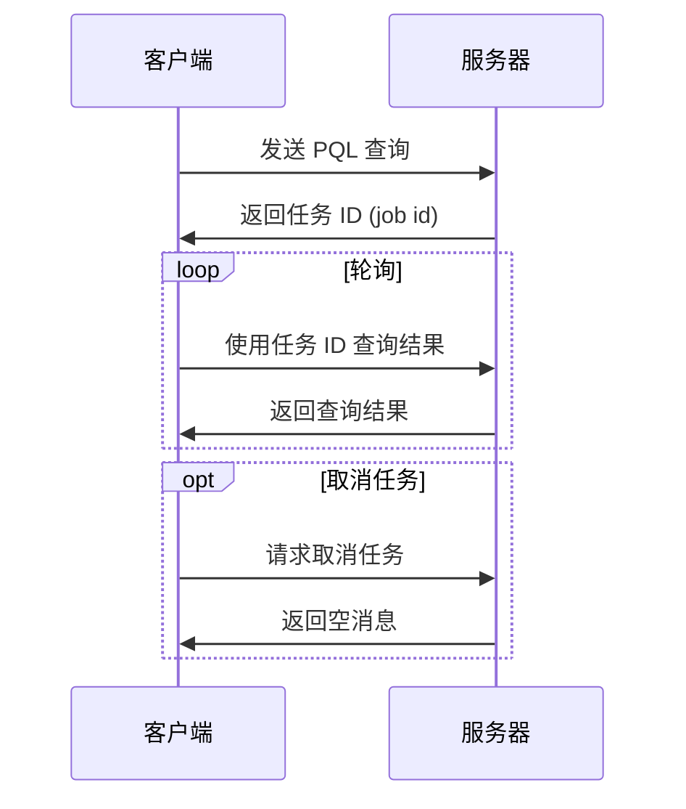

# 日志搜索开放 API

## 1. 背景

对于希望使用日志平台 API 定期拉取日志的用户，我们开发了查询开放 API。

**请注意：**
1.  查询开放 API 并非为拉取大量日志而设计。如需拉取大量日志，请参阅相关日志投递文档。
2.  与日志搜索 v1 相比，搜索开放 API v2 允许您：
    -   指定无限制的查询时间范围
    -   分页获取查询结果
    -   创建聚合查询
3.  此 API 自 `Carbon v1.10` 起支持。

## 2. API

### 交互流程



### 2.1 创建搜索任务

-   **URL**: `https://{{site}}/openapi/v2/search/jobs`
-   **方法**: `POST`
-   **请求头**:
    -   `x-openapi-key`: 从 OpenAPI 概览创建的访问令牌。
    -   `Content-Type`: `application/json`
-   **请求体**:
    ```json
    {
        "applications": [], // CMDB 应用列表
        "start_time": "0",  // RFC3339 格式字符串或 Unix 毫秒时间戳, 例如 "2023-03-15T13:09:24.000+08:00"
        "end_time": "0",    // RFC3339 格式字符串或 Unix 毫秒时间戳, 例如 "2023-03-15T13:09:24.000+08:00"
        "query": ""         // PQL 查询字符串
    }
    ```
    关于查询表达式详情，请参阅 PQL 文档。

-   **响应体**:
    ```json
    {
        "id": "搜索任务的 ID"
    }
    ```
-   **错误处理**:
    -   **OpenAPI 认证错误**: 详情请参阅 OpenAPI 概览。
    -   **查询错误**:
        -   `403` `7`: `you don't have permission on xxx` (您没有 xxx 应用的权限)。OpenAPI 令牌对应的邮箱没有应用的 `ViewLog` 权限。请检查权限设置。
        -   `start_time` 和 `end_time` 之间的时间跨度应小于1天。您可以通过拆分时间范围并发送多个查询来获取超过1天的日志。
        -   CMDB 应用不包含 `env`, `idc` 等元素。

### 2.2 轮询查询结果

-   **URL**: `https://{{site}}/openapi/v2/search/jobs/<SEARCH_JOB_ID>`
-   **方法**: `GET`
-   **请求头**:
    -   `x-openapi-key`: 从 OpenAPI 概览创建的访问令牌。
-   **URL 参数**:
    -   `SEARCH_JOB_ID` (路径参数, **必需**, 字符串): 搜索任务 ID。
    -   `offset` (可选, 数字): 结果偏移量。
    -   `limit` (可选, 数字): 返回结果数量。
    -   `blocking` (可选, 布尔值): 是否阻塞直到查询完成。
-   **响应体**:
    ```json
    {
        "state": "DONE", // 枚举值, 可用值:
                         //  - RUNNING: 查询正在运行
                         //  - DONE: 查询已完成
                         //  - CANCELLED: 查询已被用户取消
                         //  - FAILED: 查询失败
        "code": 0,       // 查询响应码
        "message": "failed reason", // 查询失败的原因
        "entries": [
            {}
        ],               // 查询结果日志
        "total_size": 1  // 查询结果的总日志条数
    }
    ```
    **注意**：当 `state` 为 `DONE` 时，请尽快轮询结果，服务器最多会保留 5 分钟的缓存。

### 2.3 取消查询任务

-   **URL**: `https://{{site}}/openapi/v2/search/jobs/<SEARCH_JOB_ID>`
-   **方法**: `DELETE`
-   **请求头**:
    -   `x-openapi-key`: 从 OpenAPI 概览创建的访问令牌。
-   **URL 参数**:
    -   `SEARCH_JOB_ID` (路径参数, **必需**, 字符串): 搜索任务 ID。

## 3. 示例

### 启动搜索任务
```shell
curl --location --request POST 'https://{{site}}/openapi/v2/search/jobs' \
--header 'x-openapi-key: {{你的令牌}}' \
--header 'Content-Type: application/json' \
--data-raw '{
    "applications": ["{{你的应用}}"],
    "start_time": "1704366859538",
    "end_time": "1704366859538",
    "query": "* | sort by @timestamp desc"
}'
```

### 轮询查询结果
```shell
curl --location 'https://{{site}}/openapi/v2/search/jobs/<搜索任务ID>?offset=10&limit=1' \
--header 'x-openapi-key: {{你的令牌}}'
```

### 取消查询任务
```shell
curl --location --request DELETE 'https://{{site}}/openapi/v2/search/jobs/<搜索任务ID>' \
--header 'x-openapi-key: {{你的令牌}}'
``` 